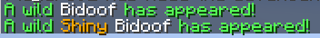
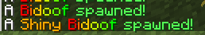

# CobblemonSpawnAlerts
A highly configurable, purely clientside mod to alert you when a certain Pokemon spawns

## No more staring at the minimap!
Have you ever been hunting for an ultra-rare, and as you're flying around your eyes are too focused on reading each Pokemon's name that you miss something? Well with this mod, you can simply receive a message in chat when the Pokemon spawns instead! The config is a JSON file that is very easy to edit and add any Pokemon you want.

## Customizability!
Each Pokemon can be individually customized exactly to your needs. If you want to shiny hunt for a Ralts while making sure you don't miss out on any beautiful Bidoofs (i love bidoof), you can do that. Messages use MiniMessage formatting to easily color or format messages however you like (see the [MiniMessage docs](https://docs.advntr.dev/minimessage/format.html)). <br>The default message looks like this:<br>


## Works with exiting spawn notifications mod!
The mod is fully clientside so it does not at all affect the [Cobblemon Spawn Notification](https://modrinth.com/mod/cobblemon-spawn-notification) mod by [tmetcalfe89](https://modrinth.com/user/tmetcalfe89). It is a great mod, so if you don't somehow know about it I highly recommend using it on your server! It is also partly what inspired this mod.

## Config
The config is found in your Minecraft instance folder under `config -> cobblemon-spawn-alerts`.<br><br>
`default_spawn_message.txt` is, as the name suggests, the default spawn message for when a Pokemon spawns. By default it is set to `cobblemon-spawn-alerts.default_spawn_message`.<br><br>
`main.json` is where the bulk of the config is at. By default, Arceus will be enabled for testing purposes. Feel free to remove or modify it. You can copy the Arceus formatting and change the name of the Pokemon to add a new spawn message for any other Pokemon.<br><br>
**Config Parameters:**<br>
*enabled*: Enables the spawn message for the Pokemon. If set to false, this setting will override every other config setting for the Pokemon and make its spawn message never display.<br>
*alwaysAlert*: Whether to always alert the Pokemon's spawn message, assuming enabled is set to true. Setting this to false will only display a spawn message given some other condition is true (e.g. alertShiny).<br>
*alertShiny*: Whether to alert a shiny Pokemon, or if the Pokemon is shiny. If alwaysAlert is set to false, this will ONLY alert that Pokemon's spawn if it is shiny. If alwaysAlert is set to true, then it will simply specify if the spawned Pokemon is shiny.<br>
*customAlertMessage*: Used to create a custom alert message for a Pokemon using [MiniMessage](https://docs.advntr.dev/minimessage/format.html) format.

## Custom alert messages: Dynamic Replacement
Custom alert messages currently only have the option to display whether a Pokemon is shiny or not (more to come soon!).<br>
To include the shiny message in your custom alert message, add `{shiny}` EXACTLY like that. This will replace `{shiny}` with nothing if it isn't shiny, or `<gold>Shiny </gold>` if it is shiny.<br><br>
**Example:**<br>
```json
"bidoof": {
    "enabled": true,
    "alwaysAlert": true,
    "alertShiny": true,
    "customAlertMessage": "<white>A</white> {shiny}<rainbow>Bidoof <green>spawned!"
  }
```
This produces the following messages when Bidoof spawns:<br>


## More to come!
I made this mod in one day, so it is quite obviously lacking many features. In no particular order, I plan to add:
*Customizable shiny message
*Show Pokemon coordinates (toggleable, show in main message or on hover)
*Show Pokemon level, IVs, nature, etc. (individually toggleable, show in main message or on hover)
*Make each part of the message customizable after coordinates and stats are added, with dynamic replacement support for custom messages
